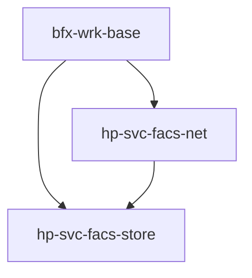

# Holepunch Facilities – Combined Overview

This document stitches together the three core repositories used throughout the 48-hour assessment:

1. **`bfx-wrk-base`** – the *skeleton* every worker hangs on.  
2. **`hp-svc-facs-store`** – the *persistent storage* layer.  
3. **`hp-svc-facs-net`** – the *network / RPC* layer.

Understanding how they interlock will let you spin up new services in minutes instead of hours.

---

## Dependency Graph

Legend:
* `A → B` means *A loads/uses B as a facility*.
* Dashed arrow indicates runtime dependency but not load-order critical.

### Why This Order Matters
1. **Store** must start *before* Net so that Net can persist/load its seeds.  
2. When you call `setInitFacs`, give *Store* a lower priority number (higher priority) to ensure this boot sequence.

Example:
```js
this.setInitFacs([
  ['fac', 'hp-svc-facs-store', null, 'default', { storeDir: './data' }, 0],
  ['fac', 'hp-svc-facs-net',   null, 'default', { timeout: 15000 }, 10]
])
```

---

## Data Flow Walk-through
1. **Service start** – `bfx-wrk-base` loads configuration and starts facilities.
2. **Store facility** initialises Corestore at `./data/corestore` and is ready to hand out Hyperbees.
3. **Net facility** asks Store for a *configuration Bee* (`storeConf`) where it keeps seeds.
4. Net spins up a DHT node & RPC server using those seeds.
5. Your **domain code** (either inside `_start` or a custom facility) now calls:
   * `await this.net_default.jTopicRequest('user-profile', 'get', { id })`  
     or
   * `const db = await this.store_default.getBee({ name: 'profiles' })`

Everything is self-contained—no external DB, no IP addresses, no central server.

---

## Recommended Project Structure
```
my-service/
 ├─ index.js            ← extends bfx-wrk-base
 ├─ facilities/
 │   └─ profile.js      ← custom domain facility (CRUD profiles)
 ├─ config/
 │   ├─ dev.store.json
 │   ├─ dev.net.json
 │   └─ dev.json        ← other service-level config
 └─ status/
```

Key tips:
* Keep **environment-specific** config in separate files (e.g., `dev.net.json`).
* Use **facility labels** (`'default'`, `'secondary'`, …) if you need multiple instances.
* Expose RPC methods **inside Net’s `handleReply` path** or create a small wrapper facility that calls `net.startRpcServer()` once ready.

---

## Testing Strategy
1. **Local mock network** – Spin up two instances of your worker on `localhost`. They will automatically discover each other because Net allows local connections (`allowLocal: true`).
2. **Integration tests** – Use [`hp-rpc-cli`](https://www.npmjs.com/package/hp-rpc-cli) to send requests directly to your worker’s publicKey.
3. **Persistence check** – Delete the `./data` directory *except* for Corestore files; restart the worker and ensure publicKey stays the same.

---

## Summary Cheat-Sheet
| Task | API Call |
|------|----------|
| Get / create a KV store | `await this.store_default.getBee({ name: 'profiles' }, { keyEncoding: 'utf-8', valueEncoding: 'json' })` |
| Send RPC request by topic | `await this.net_default.jTopicRequest('profiles', 'get', { id: 1 })` |
| Announce your service | `this.net_default.startLookup({ announceTTL: 60_000 }).announceInterval('profiles')` |
| Shut down gracefully | `process.on('SIGINT', () => worker.stop())` |

With these building blocks you can deliver the assessment’s required backend service (CRUD over RPC with persistent storage) confidently and within the allotted 12–15 hours. 